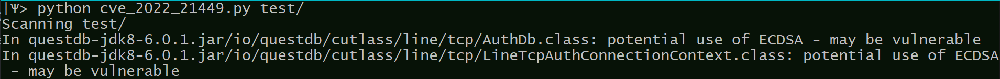

# CVE-2022-21449

### Overview

This tool allows to perform a quick scan of compiled code archives (.jar, .war etc) in order to check for vulnerability to CVE-2022-21449 by looking for the string indicating the use of ECDSA algorithm. The tool uses Python3 with no additional prerequisites.

##### Usage

```
python cve_2022_21449.py root-folder [-quiet] [-exclude folder1 folder2 ..]
```

or

```
python cve_2022_21449.py root-archive [-quiet] [-exclude folder1 folder2 ..]
```

The tool will scan `root_folder` recursively for `.jar` and `.war` files; in each located archive the tool examines the `.class` files for appearances of `"withECDSA"` string.

With `-quiet` flag, error messages (files not found/ archives failed to open/ password protected archives) are muted.

Folders appearing after `-exclude` (optional) are skipped.

##### Output example



### Bash script

Alternatively, one could use the `cve_2022_21449.sh` Bash script, which is somewhat slower, and requires installing zipgrep tool.

Usage:

```
./cve_2022_21449.sh root-folder
```
